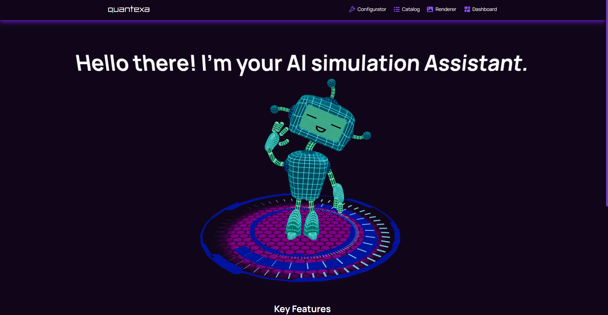
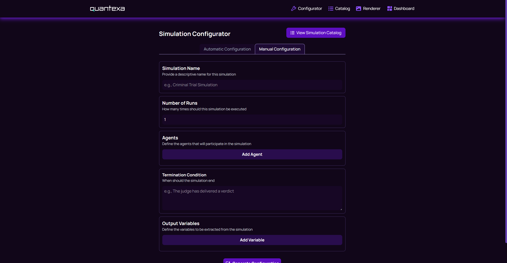
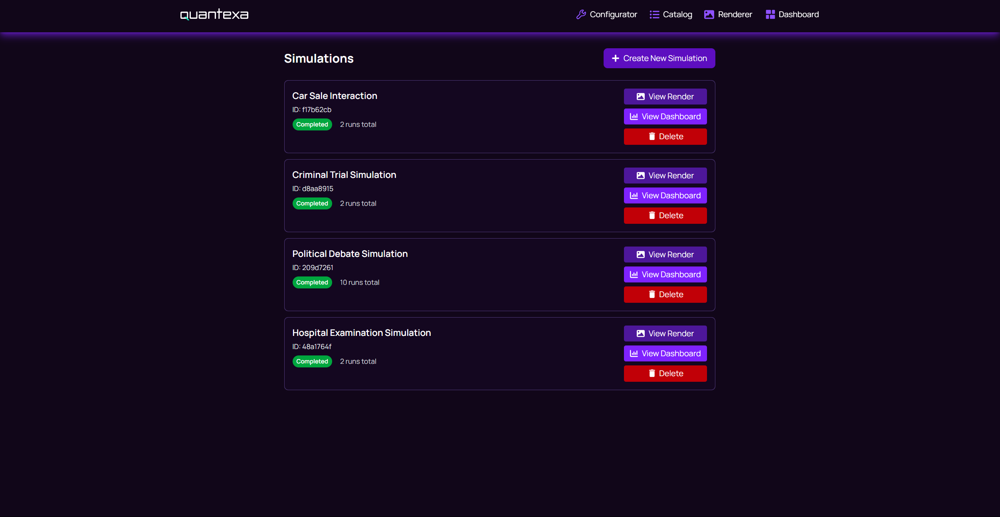
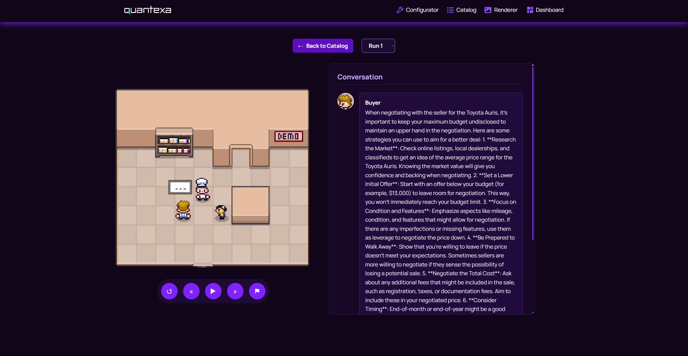
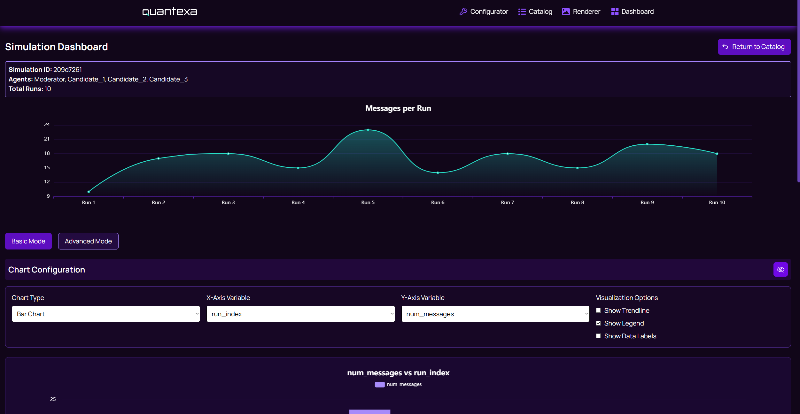

# Multi-Agent Simulation Framework - SwEng Project 22

## 🖼️ Visual Walkthrough

<h3 align="center">Landing Page</h3>



<h3 align="center">Configurator</h3>



<h3 align="center">Simulation Catalog</h3>



<h3 align="center">Renderer</h3>



<h3 align="center">Dashboard</h3>



## 🔧 Prerequisites

To run this project locally, ensure you have the following installed:

- Node.js with 'npm' installed
- Python 3.8+ with 'pip' installed
- MongoDB – a local MongoDB instance is required for database operations.
- OpenAI API Key

**(Optional):** MongoDB Compass is recommended to visualize how the queue, catalog, and output syncs with the backend.

## 🚀 Getting Started

### Running Backend Service

- Install required python modules: \
   `pip install -r backend/src/requirements.txt`

- Install mongo:
  ```bash
  # on Mac
  brew tap mongodb/brew
  brew install mongodb-community@6.0
  brew services start mongodb/brew/mongodb-community@6.0
  ```

- Run service:
  ```bash
  export OPENAI_API_KEY="..."  
  # export AZURE_OPENAI_ENDPOINT="..." AZURE_OPENAI_API_KEY="..."
  # export OLLAMA_MODEL="qwen3:4b"
  export DB_CONNECTION_STRING="mongodb://localhost:27017"
  python backend/src/main.py
  ```

### Running Frontend

1. Install required node modules:
   ```bash
   nvm use 20
   npm install
   ```
2. Run the frontend:
   ```bash
   npm run dev
   ```

## ✨ Key Features

Our framework makes it easy to create and analyze complex multi-agent simulations powered by LLMs.

- 🛠️ **Agent Configurator**  
  Define roles, goals, and hyperparameters for agents. Queue your simulation and let the system handle the rest.

- 🖼️ **Simulation Renderer**  
  Visualize multi-agent interactions, including adversarial and partial-information scenarios, for deeper insights.

- 📊 **Analytics Dashboard**  
  Track performance metrics, outcome distributions, and refine your simulation strategies through continuous feedback.

## 🔭 Next Steps

Here are some planned improvements and future considerations for the project:

- 👤 **User Accounts**  
  Implement authentication and user-specific simulation management.

- 🖼️ **Enhanced Rendering Capabilities**  
  Add support for more detailed visualizations, including 3D rendering, and TTS audio output.

- 💳 **Simulation Payment System**  
  Integrate a payment gateway to allow users to pay per simulation or subscribe for premium access.

- ☁️ **Deployment & Hosting**  
  Host the full-stack application online for public access, enabling real-time usage and persistent data storage.
